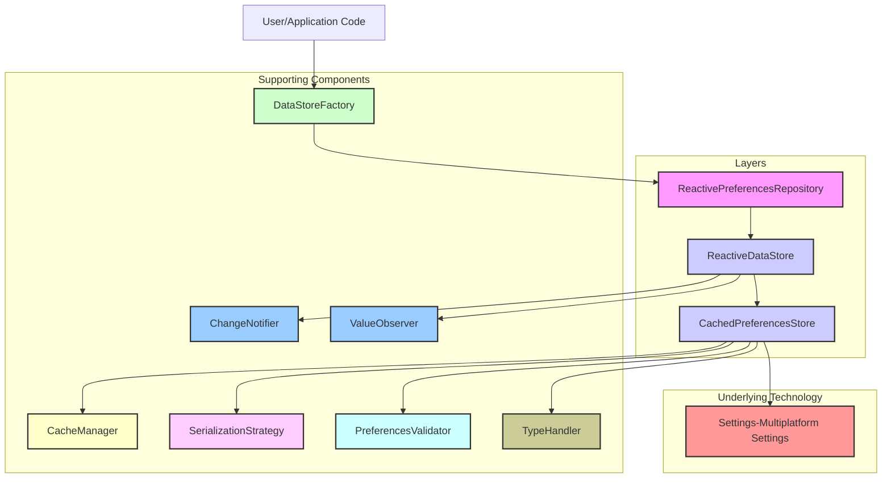

# Core Datastore Module [Deprecated]

> \[!Important]
> This module serves as a demonstration of Architecture & SOLID Pattern principles with comprehensive unit testing. The
> settings library already provides the same functionality, and under the hood it'd use that library, consider directly
> using that and this will be removed soon from this project.

A robust, type-safe, and reactive data storage solution for Kotlin Multiplatform projects, built on
top of [Multiplatform Settings](https://github.com/russhwolf/multiplatform-settings). This module
provides a flexible API for managing persistent data with support for caching, validation, and
reactive observation using Kotlin Flows.

## Features

- Type-safe data storage for primitive and serializable types
- In-memory caching with LRU implementation for performance
- Data validation for keys and values
- JSON serialization/deserialization using `kotlinx.serialization`
- Reactive data observation using Kotlin Coroutines Flow
- Dedicated support for user preferences management
- Comprehensive exception handling
- Flexible instance creation and dependency management via a Factory

## Architecture

The `core-base/datastore` module is designed with a layered and component-based architecture to
ensure modularity, testability, and flexibility. It separates concerns into distinct layers and
components, allowing for customization and easier maintenance.

**Core Layers:**

1. **Contracts:** Defines the fundamental interfaces that outline the capabilities of different data
   store implementations. This layer provides abstractions for basic storage operations, key-value
   storage, caching, and reactive observation.
2. **Stores:** Contains the concrete implementations of the data storage logic. These classes
   interact with the underlying `Multiplatform Settings` library and integrate supporting components
   like caching, serialization, and validation.
3. **Repositories:** Offers a higher-level, more use-case oriented API built on top of the data
   stores. The reactive repository provides convenient methods for common preference management
   tasks and reactive observation.

**Supporting Components:**

- **Factory:** The `DataStoreFactory` provides a builder pattern for creating and configuring
  instances of the reactive data store and repository. It simplifies the process of assembling the
  various components with desired settings, dispatchers, cache configurations, validators, and
  serialization strategies.
- **Serialization:** Defines strategies for converting complex data objects to and from storable
  formats, primarily using `kotlinx.serialization` for JSON.
- **Validation:** Implements rules for validating keys and values before they are stored, ensuring
  data integrity.
- **Cache:** Provides an optional in-memory caching layer (`LRUCacheManager`) to improve read
  performance for frequently accessed data.
- **Reactive:** Includes components (`ChangeNotifier`, `ValueObserver`) that enable the reactive
  capabilities of the data store, allowing observers to react to data changes via Kotlin Flows.
- **Type Handling:** Manages the specific logic required to store and retrieve different primitive
  data types using the underlying settings mechanism.
- **Exceptions:** Defines custom exception classes for specific error conditions within the module.

**Architecture Flow:**

The typical interaction flow involves the **Repository** layer calling methods on the **Store**
layer. The **Store** layer then utilizes **Serialization**, **Validation**, **Type Handling**, and *
*Cache** components as needed before interacting with the underlying **Settings** implementation. *
*Reactive** components are integrated within the **Store** layer to provide Flow-based observation.
The **Factory** is responsible for assembling and configuring these components.

**Diagram:**



## Usage

### Basic Usage

This section demonstrates how to use the basic `DataStore` for a custom type.

```kotlin
// Define your data class with serialization annotation
@Serializable
data class UserData(val name: String, val age: Int)

// Create serializer and validator instances
// Using JsonSerializationStrategy requires a KSerializer for your data type
val serializer = JsonSerializationStrategy(UserData.serializer())
// Use DefaultDataStoreValidator if no specific validation is needed
val validator = DefaultDataStoreValidator<UserData>()

// Obtain DataStore instance from a factory (assuming a DataStoreFactory is provided via DI or elsewhere)
// The factory is responsible for creating instances based on the desired configuration
val dataStore: DataStore<UserData> = dataStoreFactory.createDataStore(serializer, validator)

// Store data asynchronously
dataStore.setData(UserData("John", 30))

// Get data as a Coroutines Flow. The flow emits the current data and subsequent changes.
dataStore.getData().collect { userData ->
    println("User: ${userData.name}, Age: ${userData.age}")
}

// To get a snapshot of the current data without observing future changes, you might use:
// val currentUserData = dataStore.getData().first() // Requires importing kotlinx.coroutines.flow.first
```

### Using Typed DataStore

`TypedDataStore` is suitable for scenarios where you need to store multiple pieces of data of the
same type, identified by a key.

```kotlin
// Assuming UserData, serializer, and validator are defined as above

// Create a typed data store. The second type parameter defines the type of the key.
val typedDataStore: TypedDataStore<UserData, String> =
    dataStoreFactory.createTypedDataStore<UserData, String>(
        serializer,
        validator
    )

// Store data with a specific key
typedDataStore.setDataForKey("user1", UserData("John", 30))
typedDataStore.setDataForKey("user2", UserData("Jane", 25))

// Get data by key as a Flow
typedDataStore.getDataForKey("user1").collect { userData ->
    // userData will be null if no data is stored for this key
    println("User for key user1: ${userData?.name}, Age: ${userData?.age}")
}

// To get a snapshot for a specific key:
// val user1Snapshot = typedDataStore.getDataForKey("user1").first()
```

### Using Cacheable DataStore

`CacheableDataStore` adds an in-memory caching layer to a `TypedDataStore`, improving read
performance for frequently accessed data.

```kotlin
// Assuming UserData, serializer, and validator are defined as above

// Create a CacheManager. LRUCacheManager is a common choice.
// The cache stores data in memory, mapping keys to data objects.
val cacheManager = LRUCacheManager<String, UserData>()

// Create a cacheable data store, combining TypedDataStore functionality with caching.
val cacheableDataStore: CacheableDataStore<UserData, String> =
    dataStoreFactory.createCacheableDataStore(
        serializer,
        validator,
        cacheManager
    )

// Store and cache data. Storing data through CacheableDataStore will also update the cache.
cacheableDataStore.setDataForKey("user1", UserData("John", 30))

// Get data, potentially served from the cache if available and not invalidated.
cacheableDataStore.getCachedData("user1").collect { userData ->
    println("User from cacheable store (key user1): ${userData?.name}, Age: ${userData?.age}")
}

// Note: The underlying storage is still used to persist data. The cache is an optimization layer.
// Cache invalidation strategies or manual cache management might be needed for complex scenarios.
```

### Using User Preferences

The `UserPreferencesRepository` provides a simple key-value store for basic user settings, typically
backed by Multiplatform Settings.

```kotlin
// Obtain UserPreferencesRepository instance, usually through Dependency Injection
// Assuming 'get<UserPreferencesRepository>()' is available in your context (e.g., Koin)
val userPreferences: UserPreferencesRepository = get<UserPreferencesRepository>()

// Store preferences for various primitive types
userPreferences.setString("theme", "dark")
userPreferences.setBoolean("notifications", true)
userPreferences.setInt("fontSize", 14)
// ... other primitive types supported by Multiplatform Settings

// Get preferences as Flows
userPreferences.getString("theme", defaultValue = "light").collect { theme ->
    println("Current theme: $theme")
}

userPreferences.getBoolean("notifications", defaultValue = false).collect { enabled ->
    println("Notifications enabled: $enabled")
}

// Note: Use appropriate default values when retrieving preferences to handle cases where a preference is not set.
```

## Guidelines

- **Choosing the Right DataStore:**
    - Use `DataStore` for storing a single instance of a complex data object (e.g., user profile
      data).
    - Use `TypedDataStore` for storing multiple instances of a data object, addressable by a unique
      key (e.g., cached API responses, individual settings for different features).
    - Use `CacheableDataStore` when you need the functionality of `TypedDataStore` and want to add
      an in-memory caching layer for performance.
    - Use `UserPreferencesRepository` for simple key-value storage of primitive types, suitable for
      user settings and flags.

- **Key Naming:** When using `TypedDataStore` or `UserPreferencesRepository`, use clear and
  consistent key names, perhaps following a convention like `featureName_dataType_identifier`.

- **Serialization:** Always use `@Serializable` annotation from `kotlinx.serialization` for data
  classes stored using `DataStore`, `TypedDataStore`, or `CacheableDataStore`. Ensure you have the
  necessary serializer instances.

- **Validation:** Implement `DataStoreValidator` if your data requires specific validation rules
  before storage or after retrieval.

- **Error Handling:** The DataStore operations typically use Kotlin Result or throw exceptions for
  failures during serialization, deserialization, or storage. Implement appropriate error handling
  in your data flows or suspending functions.

- **Schema Evolution:** The current module does not include built-in support for schema migrations.
  If your data structure changes in future versions of your application, you will need to handle
  data migration manually, for example, by checking a version flag in your preferences or
  implementing a migration logic during app startup.

- **Dependency Injection:** It is recommended to obtain instances of `DataStoreFactory` and
  `UserPreferencesRepository` through dependency injection (e.g., using Koin) rather than creating
  them directly in your application code. This promotes testability and modularity.

## Testing

The module includes comprehensive test cases for all components. Run the tests using:

```bash
./gradlew :core-base:datastore:test
```

Ensure you write tests for your specific DataStore implementations and validators when using this
module.