# KPT Design System

A comprehensive, Kotlin Multiplatform design system built on top of Material3, providing reusable UI components, theming
capabilities, and layout primitives for building consistent user interfaces across platforms.

## 🌟 Overview

The KPT Design System offers a robust foundation for building modern applications with:

- **Consistent theming** across all platforms
- **Responsive layouts** that adapt to different screen sizes
- **Material3 integration** with custom design tokens
- **Component composition** with flexible configuration
- **Type-safe APIs** with Kotlin DSL builders

## 🎯 Key Features

- **🎨 Comprehensive Theming**: Complete design token system with color, typography, spacing, shapes, and elevation
- **📱 Responsive Design**: Adaptive layouts that work across phones, tablets, and desktop
- **🔧 Material3 Integration**: Seamless integration with Material3 components
- **⚡ Type Safety**: Kotlin DSL builders with compile-time safety
- **🎭 Consistent Animations**: Material Motion compliant animation specifications
- **🧩 Composable Architecture**: Flexible component composition with configuration objects
- **🌗 Dark Mode Support**: Built-in support for light and dark themes
- **♿ Accessibility**: Semantic properties and content descriptions throughout
- **🧪 Testing Support**: Test tags and testing utilities included

## 📦 Module Structure

```
designsystem/
├── component/          # UI Components
│   ├── KptTopAppBar.kt
│   ├── KptAnimationSpecs.kt
│   └── ...
├── core/              # Core abstractions
│   ├── KptComponent.kt
│   ├── ComponentStateHolder.kt
│   └── ...
├── layout/            # Layout components
│   ├── KptResponsiveLayout.kt
│   ├── KptGrid.kt
│   └── ...
├── theme/             # Theme implementation
│   └── KptColorSchemeImpl.kt
├── KptTheme.kt        # Main theme composable
├── KptMaterialTheme.kt # Material3 integration
└── KptThemeExtensions.kt # Utility extensions
```

## 🏗️ Architecture


## 🎨 Theme System

The KPT Design System provides a comprehensive theming solution that extends Material3 design tokens:

### Color Scheme

```kotlin
val customTheme = kptTheme {
    colors {
        primary = Color(0xFF6750A4)
        onPrimary = Color.White
        background = Color(0xFFFFFBFE)
        // ... other colors
    }
}
```

### Typography Scale

```kotlin
kptTheme {
    typography {
        titleLarge = TextStyle(
            fontSize = 22.sp,
            fontWeight = FontWeight.Bold
        )
        // ... other text styles
    }
}
```

### Spacing System

```kotlin
// Predefined spacing scale
KptTheme.spacing.xs    // 4.dp
KptTheme.spacing.sm    // 8.dp  
KptTheme.spacing.md    // 16.dp
KptTheme.spacing.lg    // 24.dp
KptTheme.spacing.xl    // 32.dp
KptTheme.spacing.xxl   // 64.dp
```

## 🔧 Setup & Integration

### Basic Setup

```kotlin
@Composable
fun App() {
    KptMaterialTheme {
        // Your app content
        NavHost(navController, startDestination = "home") {
            composable("home") { HomeScreen() }
            // ... other destinations
        }
    }
}
```

### Custom Theme Setup

```kotlin
@Composable
fun App() {
    val customTheme = kptTheme {
        colors {
            primary = Color(0xFF1976D2)
            onPrimary = Color.White
        }
        typography {
            titleLarge = titleLarge.copy(fontSize = 24.sp)
        }
        spacing {
            md = 20.dp
        }
    }

    KptMaterialTheme(theme = customTheme) {
        // App content with custom theme
    }
}
```

### Dark Theme Support

```kotlin
@Composable
fun App() {
    val lightTheme = kptTheme { /* light theme config */ }
    val darkTheme = kptTheme { /* dark theme config */ }

    KptMaterialTheme(
        lightTheme = lightTheme,
        darkThemeProvider = darkTheme
    ) {
        // Automatically switches based on system preference
    }
}
```

## 🧩 Components(Demo)

### KptTopAppBar

Flexible top app bar with multiple variants:

```kotlin
// Simple top app bar
KptTopAppBar(title = "Title")

// With navigation and actions
KptTopAppBar(
    title = "Title",
    onNavigationIconClick = { navController.navigateUp() },
    actionIcon = Icons.Default.Search,
    onActionClick = { openSearch() }
)

// Using configuration builder
KptTopAppBar(
    kptTopAppBar {
        title = "Settings"
        variant = TopAppBarVariant.Large
        navigationIcon = Icons.AutoMirrored.Filled.ArrowBack
        onNavigationClick = { navController.navigateUp() }

        action(Icons.Default.Search, "Search") { openSearch() }
        action(Icons.Default.MoreVert, "More") { openMenu() }
    }
)
```

## 📱 Responsive Layout System

The design system includes responsive layout components that adapt to different screen sizes:

```mermaid
graph LR
    subgraph "Screen Size Breakpoints"
        Compact["Compact < 600dp"]
        Medium["Medium 600-840dp"]
        Expanded["Expanded ≥ 840dp"]
    end

    subgraph "Layout Components"
        ResponsiveLayout[KptResponsiveLayout]
        Grid[KptGrid]
        FlowRow[KptFlowRow]
        SplitPane[KptSplitPane]
        SidebarLayout[KptSidebarLayout]
    end

    Compact --> ResponsiveLayout
    Medium --> ResponsiveLayout
    Expanded --> ResponsiveLayout
    ResponsiveLayout --> Grid
    ResponsiveLayout --> FlowRow
    ResponsiveLayout --> SplitPane
    ResponsiveLayout --> SidebarLayout
```



### Usage Example

```kotlin
KptResponsiveLayout(
    compact = {
        // Single column layout for phones
        LazyColumn { /* items */ }
    },
    medium = {
        // Two column layout for tablets
        Row {
            LazyColumn(modifier = Modifier.weight(1f)) { /* left */ }
            LazyColumn(modifier = Modifier.weight(1f)) { /* right */ }
        }
    },
    expanded = {
        // Three column layout for desktop
        KptSidebarLayout {
            sidebar { NavigationRail() }
            content {
                Row {
                    LazyColumn(modifier = Modifier.weight(2f)) { /* main */ }
                    LazyColumn(modifier = Modifier.weight(1f)) { /* aside */ }
                }
            }
        }
    }
)
```

## 🎭 Animation System

Consistent animation specifications following Material Motion guidelines:

```kotlin
object KptAnimationSpecs {
    val fast = tween<Float>(150, FastOutSlowInEasing)
    val medium = tween<Float>(300, FastOutSlowInEasing)
    val slow = tween<Float>(500, FastOutSlowInEasing)

    // Material Motion easing curves
    val emphasizedEasing = CubicBezierEasing(0.2f, 0.0f, 0.0f, 1.0f)
    val standardEasing = CubicBezierEasing(0.2f, 0.0f, 0.0f, 1.0f)
}
```

## 🧪 Component State Management

The design system provides utilities for managing component state:

```kotlin
@Composable
fun MyComponent() {
    val state = rememberComponentState(initialValue = false)

    Button(
        onClick = { state.update(!state.value) }
    ) {
        Text(if (state.value) "Enabled" else "Disabled")
    }
}
```

## 🤝 Contributing

1. Follow the existing code style and patterns
2. Add comprehensive KDoc documentation to new components
3. Include usage examples in component documentation
4. Test components across different screen sizes
5. Ensure accessibility compliance with semantic properties

## 📄 License

```
Copyright 2025 Mifos Initiative

This Source Code Form is subject to the terms of the Mozilla Public
License, v. 2.0. If a copy of the MPL was not distributed with this
file, You can obtain one at https://mozilla.org/MPL/2.0/.
```

---

**Built with ❤️ for the Kotlin Multiplatform community**