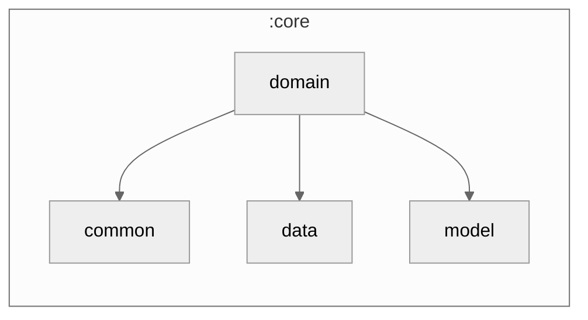

### Module Graph

```mermaid
%%{
  init: {
    'theme': 'neutral'
  }
}%%

graph LR
  subgraph :core
    :core:domain["domain"]
    :core:common["common"]
    :core:data["data"]
    :core:model["model"]
  end
  :core:domain --> :core:common
  :core:domain --> :core:data
  :core:domain --> :core:model
```