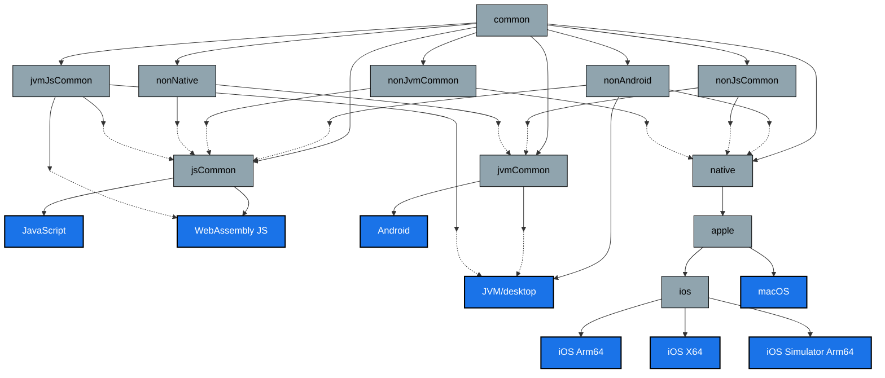

# Source Set Hierarchy in Kotlin Multiplatform

This document provides a comprehensive guide to the hierarchical structure implemented in our Kotlin
Multiplatform project. The hierarchy template establishes a logical organization of source sets,
creating efficient code sharing between platforms with similar characteristics. This approach
minimizes duplication while allowing for platform-specific implementations where necessary.

## Purpose and Benefits

Our project hierarchy offers several key advantages:

- **Optimized Code Sharing**: Share code between platforms with similar characteristics while
  maintaining the ability to provide platform-specific implementations
- **Reduced Duplication**: Avoid repeating common code across multiple platforms
- **Clear Organization**: Establishes a consistent structure for both main and test source sets
- **Simplified Maintenance**: Changes to shared code automatically propagate to all dependent
  platforms
- **Improved Build Performance**: More granular dependency structure can lead to more efficient
  compilation

## Hierarchy Structure

Our project implements a carefully designed hierarchical structure that organizes code based on
platform similarities:

### Primary Source Set Groups

| Source Set     | Description                                      | Platform Targets              |
|----------------|--------------------------------------------------|-------------------------------|
| `common`       | Base shared code for all platforms               | All platforms                 |
| `nonAndroid`   | Code shared between non-Android platforms        | JVM, JS, WebAssembly, Native  |
| `jsCommon`     | Code for JavaScript-based platforms              | JS, WebAssembly               |
| `nonJsCommon`  | Code for non-JavaScript platforms                | JVM, Android, Native          |
| `jvmCommon`    | Code for JVM-based platforms                     | JVM, Android                  |
| `nonJvmCommon` | Code for non-JVM platforms                       | JS, WebAssembly, Native       |
| `jvmJsCommon`  | Code shared between JVM and JavaScript platforms | JVM, JS, WebAssembly          |
| `native`       | Code for all native platforms                    | iOS, macOS, etc.              |
| `nonNative`    | Code for non-native platforms                    | JS, WebAssembly, JVM, Android |
| `mobile`       | Code for android and apple platforms             | Android, Apple                |

### Native Platform Subgroups

| Source Set           | Description                        | Platform Targets                 |
|----------------------|------------------------------------|----------------------------------|
| `native/apple`       | Code shared across Apple platforms | iOS, macOS                       |
| `native/apple/ios`   | iOS-specific code                  | iOS (arm64, x64, simulatorArm64) |
| `native/apple/macos` | macOS-specific code                | macOS                            |

### Specific Platform Targets

The project is configured with the following specific platform targets:

- `desktop` (JVM target)
- `androidTarget` (Android)
- `iosSimulatorArm64` (iOS simulator on Apple Silicon)
- `iosX64` (iOS simulator on Intel)
- `iosArm64` (iOS devices)
- `js` (JavaScript with Node.js)
- `wasmJs` (WebAssembly JavaScript with browser and Node.js support)

## Hierarchy Visualization



## Implementation and Usage

### Including the Hierarchy in Your Project

To apply this hierarchy to your Kotlin Multiplatform project, call the
`applyProjectHierarchyTemplate()` extension function within your Kotlin configuration block:

```kotlin
plugins {
    kotlin("multiplatform") version "1.9.20"
    // Other plugins...
}

kotlin {
    applyProjectHierarchyTemplate()

    // Platform targets configuration...
}
```

### Configuring with Default Targets

For a complete setup with default targets, you can use the provided configuration function:

```kotlin
plugins {
    kotlin("multiplatform") version "1.9.20"
    id("com.android.library")
    // Other plugins...
}

// Apply the complete configuration
configureKotlinMultiplatform()
```

This will:

1. Apply the project hierarchy template
2. Configure all default targets (JVM, Android, iOS, JS, WebAssembly)
3. Set up compiler options (including "-Xexpect-actual-classes")

## How The Hierarchy Works

The source set hierarchy defines inheritance relationships between source sets. When you place code
in a particular source set, it becomes available to all dependent source sets.

### Inheritance Example

Code placed in `jvmCommon` is automatically available to both `android` and `jvm` (desktop) source
sets:

```kotlin
// src/jvmCommonMain/kotlin/com/example/PlatformSpecific.kt
class FileManager {
    fun readLocalFile(path: String): String {
        // JVM-specific file reading implementation
        return java.io.File(path).readText()
    }
}
```

This code is now available in both Android and desktop JVM platforms, but not in JS or native
platforms.

### Making Smart Code Sharing Decisions

1. **Start with common**: Always try to place code in the `common` source set first
2. **Move down as needed**: If platform-specific APIs are required, move to the appropriate
   intermediate source set
3. **Use expect/actual sparingly**: For truly platform-specific implementations, use `expect` in
   common and `actual` in platform source sets

## Practical Code Organization

### Example Directory Structure

A typical project following this hierarchy would have a structure like:

```
src/
├── commonMain/kotlin/          # Common code for all platforms
├── nonAndroidMain/kotlin/      # Code for non-Android platforms
├── jsCommonMain/kotlin/        # Code for JS-based platforms
├── nonJsCommonMain/kotlin/     # Code for non-JS platforms
├── jvmCommonMain/kotlin/       # Code for JVM-based platforms
├── nonJvmCommonMain/kotlin/    # Code for non-JVM platforms
├── jvmJsCommonMain/kotlin/     # Code shared between JVM and JS platforms
├── nativeMain/kotlin/          # Code for native platforms
│   ├── apple/                  # Code for Apple platforms
│   │   ├── ios/                # iOS-specific code
│   │   └── macos/              # macOS-specific code
├── nonNativeMain/kotlin/       # Code for non-native platforms
├── desktopMain/kotlin/         # JVM-specific code
├── androidMain/kotlin/         # Android-specific code
├── iosMain/kotlin/             # General iOS code
├── iosArm64Main/kotlin/        # iOS device-specific code
├── iosX64Main/kotlin/          # iOS simulator (Intel) code
├── iosSimulatorArm64Main/kotlin/ # iOS simulator (Arm64) code
├── jsMain/kotlin/              # JavaScript-specific code
└── wasmJsMain/kotlin/          # WebAssembly JS-specific code
```

### Code Sharing Example

Here's an example of how code sharing works with this hierarchy:

1. Platform-agnostic code goes in `commonMain`:
   ```kotlin
   // src/commonMain/kotlin/com/example/DataModel.kt
   expect class PlatformInfo {
       fun getPlatformName(): String
   }
   
   class DataRepository(private val platformInfo: PlatformInfo) {
       fun getWelcomeMessage(): String {
           return "Hello from ${platformInfo.getPlatformName()}"
       }
   }
   ```

2. JVM-common implementation in `jvmCommonMain`:
   ```kotlin
   // src/jvmCommonMain/kotlin/com/example/DataModel.kt
   actual class PlatformInfo {
       actual fun getPlatformName(): String {
           return "JVM Platform"
       }
   }
   ```

3. Android-specific customization in `androidMain`:
   ```kotlin
   // src/androidMain/kotlin/com/example/DataModel.kt
   actual class PlatformInfo {
       actual fun getPlatformName(): String {
           return "Android"
       }
   }
   ```

4. iOS implementation in `iosMain`:
   ```kotlin
   // src/iosMain/kotlin/com/example/DataModel.kt
   actual class PlatformInfo {
       actual fun getPlatformName(): String {
           return "iOS"
       }
   }
   ```

## Additional Source Set Examples

### Sharing Network Code

For network code that uses platform-specific APIs:

```kotlin
// src/commonMain/kotlin/com/example/network/NetworkClient.kt
expect class NetworkClient() {
    suspend fun fetchData(url: String): String
}

// src/jvmCommonMain/kotlin/com/example/network/NetworkClient.kt
actual class NetworkClient {
    actual suspend fun fetchData(url: String): String {
        // JVM-specific implementation using java.net
        return URL(url).readText()
    }
}

// src/jsCommonMain/kotlin/com/example/network/NetworkClient.kt
actual class NetworkClient {
    actual suspend fun fetchData(url: String): String {
        // JS-specific implementation using fetch API
        return window.fetch(url).text()
    }
}
```

### Shared UI Logic with Platform-Specific UI

```kotlin
// src/commonMain/kotlin/com/example/ui/ViewModel.kt
class ProfileViewModel {
    // Common business logic for all platforms
}

// src/androidMain/kotlin/com/example/ui/ProfileScreen.kt
// Android-specific Compose UI

// src/iosMain/kotlin/com/example/ui/ProfileScreen.kt
// iOS-specific SwiftUI integration
```

## Dependencies Management

When adding dependencies to your project, consider the appropriate source set:

```kotlin
kotlin {
    // Configure targets...

    sourceSets {
        val commonMain by getting {
            dependencies {
                implementation("org.jetbrains.kotlinx:kotlinx-coroutines-core:1.7.3")
            }
        }

        val jvmCommonMain by getting {
            dependencies {
                implementation("com.squareup.okhttp3:okhttp:4.11.0")
            }
        }

        val androidMain by getting {
            dependencies {
                implementation("androidx.core:core-ktx:1.12.0")
            }
        }
    }
}
```

## Technical Considerations

### Kotlin Version Compatibility

This hierarchy implementation uses experimental Kotlin Gradle plugin APIs and requires Kotlin 1.9.20
or newer. It may be subject to change in future Kotlin releases.

### Build Performance

While this hierarchical structure optimizes code sharing, be mindful of potential build performance
impacts with very complex hierarchies. Monitor build times and adjust if necessary.

### Common Pitfalls

1. **Excessive Source Sets**: Too many intermediate source sets can complicate the project and slow
   down builds
2. **Circular Dependencies**: Be careful not to create circular dependencies between source sets
3. **Duplicated Implementations**: Multiple `actual` implementations for the same platform can cause
   conflicts

## Best Practices

1. **Minimize Platform-Specific Code**: Try to write as much platform-agnostic code as possible
2. **Choose the Right Source Set**: Place code in the most general source set that can support it
3. **Keep Interfaces in Common**: Define interfaces in common code and implement them in
   platform-specific code
4. **Use Clear Module Boundaries**: Maintain separation of concerns between modules
5. **Document Platform Requirements**: Clearly document when code requires specific platform
   capabilities

## Conclusion

This hierarchical source set structure provides a powerful framework for organizing Kotlin
Multiplatform code. By thoughtfully structuring source sets, you can maximize code sharing while
maintaining the flexibility to provide platform-specific implementations when needed. The clear
organization also makes the codebase more maintainable and easier to navigate.

For more information, refer to
the [Kotlin Multiplatform documentation](https://kotlinlang.org/docs/multiplatform.html)
and [Kotlin Hierarchical Project Structure documentation](https://kotlinlang.org/docs/multiplatform-hierarchy.html).